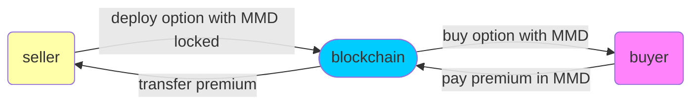
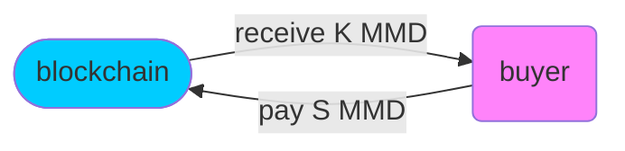
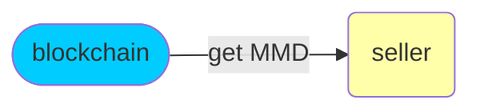
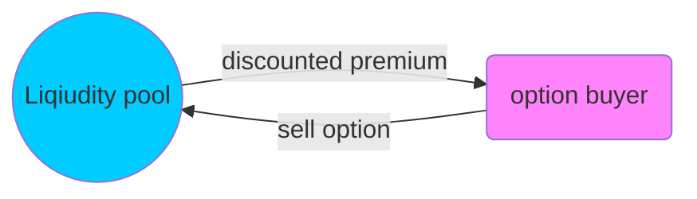
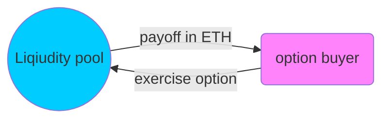

Contract deployed to: 0xdB491786f7e1BDf8BA4a49089f9Fd580706505CF(option)
Contract deployed to: 0x5f4576A8Cf609c9104353eB75f67023C7488ceed
(stable_coin)
Contract deployed to: 0xC2283AA608b5347555EDd7dDA5DC7BEA95025636
(unstable_coin)

# S-K

### Introduction

**S-K is an on-chain peer to pool option trading protocol built on Ethereum**

**Business scenario**

**sell & buy** 



**exercise**



**Retrive**



### How to Use

// to-do


### Future improvement
1. The option buyer use stable coin to pay the premium. Not use mmd. or use mmd through uniswap to change the mmd token to cmmd (stable coin).
2. The exchange rate between mmd1 and mmd2 should be implemented in the web app. (should allow the use to change)
3. In the real world, the app should be able to keep track of all of the crypto assets prices. (not make use of random function as we did in our current app).
4. For the option provider - the app will store wallet address and attach to the contract - error feedback
5. The option list available needs to be updated so that we can only see the valid/available options. (remove expired and bought option contracts)


#### Sell Option



```mermaid

```

### Business scenarios

#### Liqiud pool & Option buying

```mermaid
graph LR
a(provider):::class1 --> |ETH| b((Liqiudity pool)):::class2
d(liquidity provider):::class3 --> |MMD|b
b --> |premium| a
b --> |MMD tocken with option|c(option buyer):::class4
c --> |premium|b
classDef class1 fill:#ffaf;
classDef class2 fill:#00ccff;
classDef class3 fill:#ffe7ba;
classDef class4 fill:#ff83fa;
```

#### Exercise option



