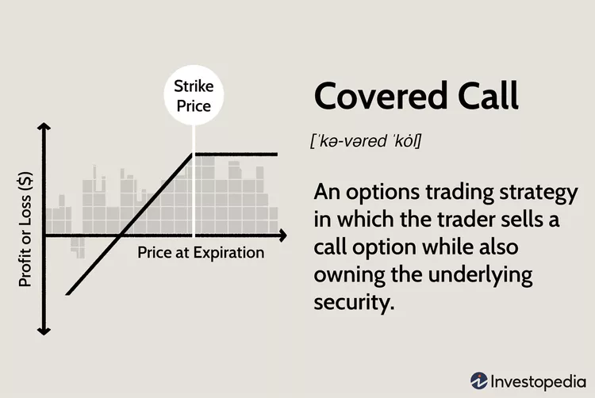
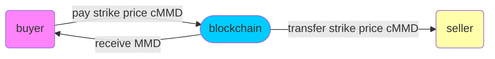
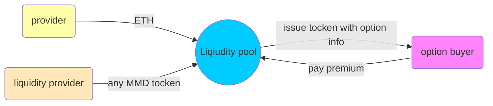
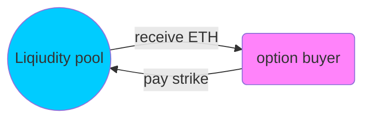

# S-K

## Introduction

**S-K is an on-chain peer to peer option trading protocol built on Ethereum network**

## **Business scenario**

### Covered Call

### **Write Option** 

### **Buy Option**

### **Exercise**

### **Retrive & Cancel**

## Contract Information

| contract      | address                                    |
| ------------- | ------------------------------------------ |
| option        | 0xdB491786f7e1BDf8BA4a49089f9Fd580706505CF |
| stable_coin   | 0x5f4576A8Cf609c9104353eB75f67023C7488ceed |
| unstable_coin | 0xC2283AA608b5347555EDd7dDA5DC7BEA95025636 |
|               | 0x6f92b3470D9a7bF6D9E638c5aD9fCb936b6a50B0 |
|               | 0xdFBE3F32139FfbA7aA0ff4305ec10ce592B44c66 |
|               | 0xd4d875308e39444C66Ba81Bac20BEeC69C5979e1 |

## **How to Use**

- prepare environment
  - cd Back-end
    - npm install --save-dev @openzeppelin/contracts
    - npm install dotenv
  - cd Front-end
    - npm install
- run tests
  - cd Back-end
    - npx hardhat test
- deploy contract
  - cd Back-end
    - npx hardhat run scripts/deploy.ts --network etherdata
- start webpage
  - cd Front-end
    - npm start

## Further Imporvement

we move from (peer to peer) to (peer to pool)

#### Liqiudity pool & Option buying

#### Exercise Option

